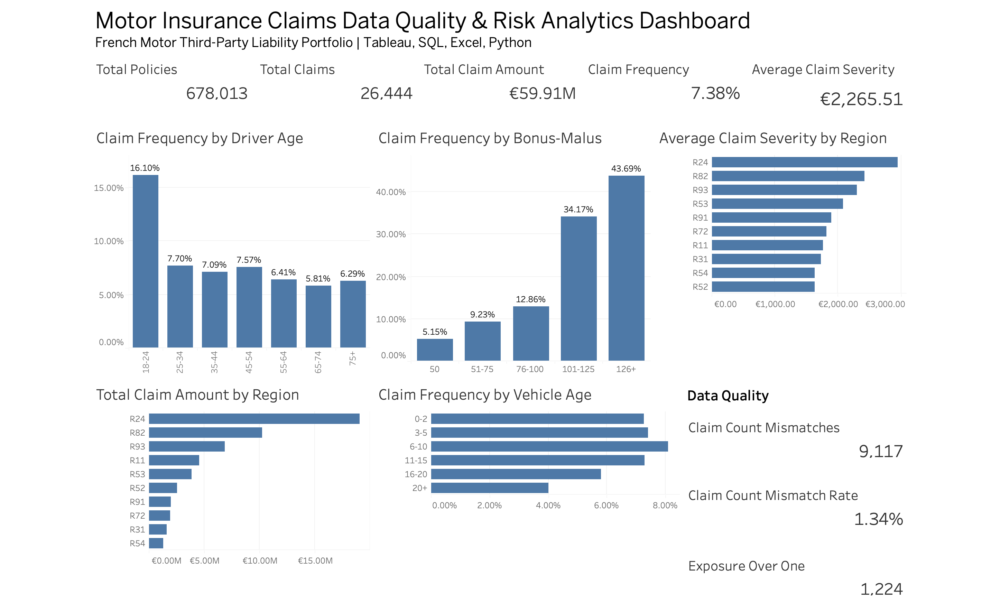

# Motor Insurance Claims Data Quality & Risk Analytics Dashboard

This project analyses a publicly available French Motor Third-Party Liability insurance dataset using Python, SQL, Excel and Tableau.

The project focuses on two areas:

1. validating and improving data quality across policy and claims records;
2. analysing claim frequency, claim severity and risk patterns through an interactive Tableau dashboard.

## Dashboard Preview



## Project Overview

The dataset contains:

- 678,013 policy records;
- 26,639 raw claim records;
- 26,444 claim records retained for analytical use after referential-integrity checks.

The workflow covers the full process from raw data profiling to final dashboard reporting:

Raw Data  
→ Python Profiling  
→ SQL Data Quality Checks  
→ SQL Cleaning and Transformation  
→ Excel Data Quality Report  
→ Tableau Risk Analytics Dashboard

## Data Source

The project uses the publicly available **freMTPL2** French Motor Third-Party Liability insurance dataset.

The data includes policy-level information such as:

- policy ID;
- claim count;
- exposure;
- vehicle age;
- driver age;
- vehicle power;
- vehicle brand;
- fuel type;
- Bonus-Malus rating;
- population density;
- area;
- region.

The claims dataset contains:

- policy ID;
- claim amount.

This project uses real public insurance data for portfolio and analytical demonstration purposes.

## Tools Used

- **Python** — raw-data profiling and issue investigation;
- **SQL / SQLite** — validation, cleaning, transformation and business analysis;
- **Excel** — data-quality audit summary;
- **Tableau Public** — dashboard development and interactive visualisation;
- **GitHub** — project documentation and version control.

## Data Quality Assessment

The raw data was profiled before any cleaning decisions were made.

Key findings included:

| Data Quality Check | Result |
|---|---:|
| Missing values | 0 |
| Duplicate policy IDs | 0 |
| Identical policy-claim amount combinations | 241 |
| Orphan claim records | 195 |
| Orphan policy IDs | 6 |
| Claim count mismatches | 9,117 |
| Policies with exposure greater than 1 | 1,224 |
| Invalid claim amounts | 0 |

### Cleaning Decisions

Not every unusual record was automatically removed.

- **Orphan claims** were excluded from the analytical claims table because they could not be linked to a valid policy.
- **Claim count mismatches** were retained and flagged for data-quality monitoring.
- **Identical claim records** were retained because the source data does not contain a unique Claim ID, so true duplication cannot be confirmed.
- **Exposure values above 1** were retained and flagged rather than treated as automatically invalid.
- **Large claims** were retained because extreme losses are an important part of insurance risk analysis.

This approach preserves potentially valid business information while keeping data-quality issues visible.

## Data Model

The project uses two core datasets:

```text
Policies
   |
   | IDpol
   v
Claims

The purpose of the project is to demonstrate how raw insurance data can be validated, transformed and converted into useful business insights while keeping data-quality issues visible.
Data Source
The project uses the publicly available freMTPL2 French Motor Third-Party Liability insurance dataset.
The policy dataset includes fields such as:
- Policy ID;
- Claim Count;
- Exposure;
- Vehicle Power;
- Vehicle Age;
- Driver Age;
- Bonus-Malus Rating;
- Vehicle Brand;
- Fuel Type;
- Area;
- Population Density;
- Region.
The claims dataset contains:
- Policy ID;
- Claim Amount.
This project uses real public insurance data for portfolio and analytical demonstration purposes.
Tools Used
- Python — raw-data profiling and investigation of data-quality issues;
- SQL / SQLite — validation, cleaning, transformation and business analysis;
- Excel — data-quality audit summary;
- Tableau Public — dashboard development and interactive visualisation;
- GitHub — project documentation and version control.
Data Quality Assessment
The raw datasets were profiled before any cleaning decisions were made.
Key data-quality findings included:
| Data Quality Check | Result |
|---|---:|
| Missing Values | 0 |
| Duplicate Policy IDs | 0 |
| Identical Policy-Claim Amount Combinations | 241 |
| Orphan Claim Records | 195 |
| Orphan Policy IDs | 6 |
| Claim Count Mismatches | 9,117 |
| Policies With Exposure Greater Than 1 | 1,224 |
| Invalid Claim Amounts | 0 |
Cleaning Decisions
Not every unusual record was automatically removed.
- Orphan claims were excluded from the analytical claims table because they could not be linked to a valid policy.
- Claim count mismatches were retained and flagged for data-quality monitoring.
- Identical claim records were retained because the source dataset does not contain a unique Claim ID, so true duplication cannot be confirmed.
- Exposure values above 1 were retained and flagged rather than automatically classified as invalid.
- Large claims were retained because extreme losses are an important part of insurance risk analysis.
This approach avoids removing potentially valid business information without sufficient evidence.

Data Model
The project uses a simple policy-to-claims relationship:
Policies
   |
   | IDpol
   v
Claimsc
The cleaned analytical layer contains:
- policies_clean
- claims_clean
- policy_claim_summary
policy_claim_summary combines policy attributes, claim metrics and data-quality flags for reporting and Tableau analysis.